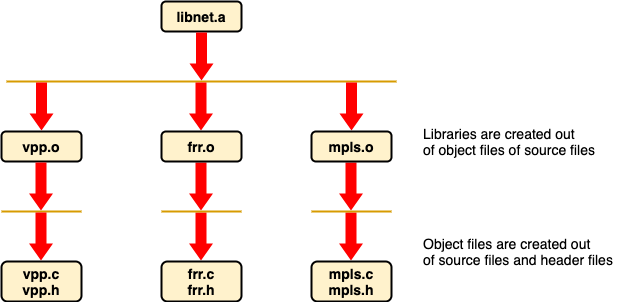
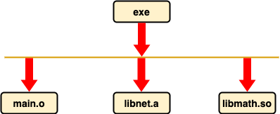

# Makefile

Makefile is a program building tool which runs on Unix, Linux and their flavors. It aids in simplifying building the software program that may dependent on various other libraries.

Functions of Makefile:

1. Compiling

2. Linking

3. Creating required libraries - static and dynamic

4. Create required executables

5. Installation of libraries and executables

6. Update dependencies

Makefile works on the concept of dependency tree. Level N element cannot be prepared unless all its immediate descendants elements at level N+1 are available. Root element is the target we want to prepare. If element at level N is changed or updated, all ancestors from level N-1 up to root of the tree needs to be updates.

```bash
|--Makefile
|
|
|--source1
|        |
|        |
|        |--s1_folder1--
|        |             |
|        |             |--main.c
|        |             |--vpp.c
|        |             |--vpp.h
|        |
|        |--s1_folder2--
|        |             |--main.c
|        
|--source2
         |
         |
         |--s2_folder1--
         |             |
         |             |--main.c
         |             |--frr.c
         |             |--frr.h
         |
         |
         |--S2_folder2--
                      |
                      |--main.c
                      |--mpls.c
                      |--header.h

```
The project tree directory is illustrated as above. It is frustrating to compile each source separately. Therefore, there should be a mechanism to systematically compile the entire project. I aim to produce executable file and a library called libnet.a static library.



In makefiles, we write rules which have the following syntax:

```
<What we want to prepare (Final Dish)> <What are raw materials we need to prepare the final dish> <Action>
```

```
vpp.o: source1/s1_folder1/vpp.c
 gcc -c -I source1/s1_folder1 source1/s1_folder1/vpp.c -o source1/s1_folder1/vpp.o

frr.o: source2/s2_folder1/frr.c
 gcc -c -I source2/s2_folder1 source2/s2_folder1/frr.c -o source2/s2_folder1/frr.o

mpls.o: source2/s2_folder2/mpls.c
  gcc -c -I source2/s2_folder2 source2/s2_folder2/mpls.c -o source2/s2_folder2/mpls.o
```
* Switch c is for compilation
* Switch -I (capital) is used to specify the location of header files (directory).

Now, all .o elements are ready to build libnet.a
```
libnet.a: source1/s1_folder1/vpp.o source2/s2_folder1/frr.o source2/s2_folder2/mpls.o
  ar rs mylibnet.a source1/s1_folder1/vpp.o source2/s2_folder1/frr.o source2/s2_folder2/mpls.o
```

Our static library has been created. Now we want to create our executable file which first needs main functions as well as the libnet.a and another external dynamic library called let's say libmath.so.



```
exe:  source1/s1_folder1/main.o source1/s1_folder2/main.o source2/s2_folder1/ main.o source2/s2_folder2/main.o libnet.a
  gcc source1/s1_folder2/main.o -o exe -L . libnet.a -lm

source1/s1_folder1/main.o: source1/s1_folder1/main.c
  gcc -c source1/s1_folder1/main.c -o source1/s1_folder1/main.o

source1/s1_folder2/main.o: source1/s1_folder2/main.c
  gcc -c source1/s1_folder2/main.c -o source1/s1_folder2/main.o

source2/s2_folder1/main.o: source2/s2_folder1/main.c
  gcc -c source2/s2_folder1/main.c -o source2/s2_folder1/main.o

source2/s2_folder2/main.o: source2/s2_folder2/main.c
  gcc -c source2/s2_folder2/main.c -o source2/s2_folder2/main.o
```
* Switch -lm is for linking dynamic library. There is no need to explicitly mention libmath.so

It is important to note that, rules are not executed line by line in makefile. In fact it is executed in DFS manner.

---

For creating dynamic library (*.so):
```
gcc -Wall -fPIC -c *.c
gcc -shared -o [NAME_LIB].so *.o
```
